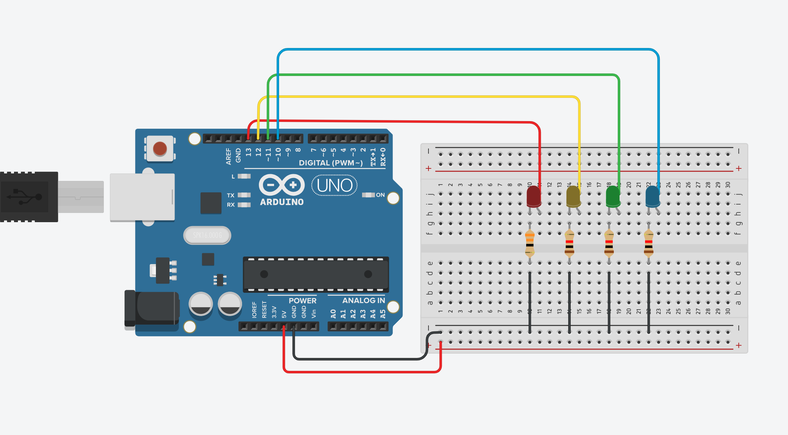

# This is the journal for comp sci

1. What did we do? 
Today we created
```.py 
x = 0 
def setup():
  size(1000, 1000)
  background(255)
  textAlign(CENTER, CENTER)
def draw():
    print("")
def mouseClicked(): 
    x = mouseX
    y = mouseY
    z = random(10,100)
    myred = random(0,250)
    myblue = random(0,255)
    mygreen = random(0,255)
    fill(myred, mygreen, myblue)
    
    circle(x, y, z)
    fill(0)
    textSize(26/1); 
    text("S&K",x,y)
    
    
    print(x, y, z)
 ```
    
    
  2. What did we learn? 
    --> We learn how to make circles as the way we want circle to appear. We created many versions of coding to make circles. 
    
    
  Homework : 1. Add lines from the middle of the window to each circle 
              2. Add lines from circle to circle
               
               
   ```            
 def setup():
  size(600, 600)
  background(255)
  strokeWeight(10)
  
def draw():
    stroke(0)
    
def mouseClicked():
    stroke(0)
    rect(100, 100, 400, 400, 50)
    stroke(255, 0, 0) #red, green, blue
    n = random(0,7)
    
    if 2<=n<3: 
        # number one
        circle(300, 300, 50)
    if 3<=n<4: 
        # number two
        circle(200, 200, 50) # top left
        circle(400, 400, 50)
    if 4<=n<5:
        # number three
        circle(300, 300, 50)
        circle(200, 200, 50) # top left
        circle(400, 400, 50)
        
    if 5<=n<6:
        # number four
        circle(200, 400, 50)
        circle(200, 200, 50) # top left
        circle(400, 200, 50)
        circle(400, 400, 50)
    
    if 4<=n<5:
        # number five
        circle(200, 400, 50)
        circle(200, 200, 50)
        circle(400, 200, 50)
        circle(400, 400, 50)
        circle(300, 300, 50)
    
    if 6<=n<7:
        # number 6
        circle(200, 400, 50)
        circle(200, 200, 50)
        circle(200, 300, 50)
        circle(400, 200, 50)
        circle(400, 400, 50)
        circle(400, 300, 50)
        ```
        
We made a dice and guessed other people's secret number. We learned how to randomize the dice and also we learned the location of the dots. 
  
  
  
  
  In this class, we practiced connecting the line of breadboard and arduino to turn the light on. 
  I made 4 different versions of turnging the light. 
 ```.c
  void setup()
{
  pinMode(13, OUTPUT);
  pinMode(12, OUTPUT);
  pinMode(11, OUTPUT);
  pinMode(10, OUTPUT);
}

void loop()
{
  digitalWrite(13, HIGH);
  delay(1000); // Wait for 1000 millisecond(s)
  digitalWrite(12, HIGH);
  delay(1000); // Wait for 1000 millisecond(s)
  digitalWrite(11, HIGH);
  delay(1000); // Wait for 1000 millisecond(s)
  digitalWrite(10, HIGH);
  delay(1000); // Wait for 1000 millisecond(s)
  digitalWrite(10, LOW);
  delay(1000); // Wait for 1000 millisecond(s)
  digitalWrite(11, LOW);
  delay(1000); // Wait for 1000 millisecond(s)
  digitalWrite(12, LOW);
  delay(1000); // Wait for 1000 millisecond(s)
  digitalWrite(13, LOW);
  delay(1000); // Wait for 1000 millisecond(s)
}
 ```
 

<Tasks for week 28>

1. What are some ways in which Computer Science can help the fight against Covid-19?
In your opinion, should people enable access to the resources of their personal computers as tools for research? Are there any risks?

- By simulating through thr coding programs, people can find out some new facts about covid-19. Without actually going through those experiments such as animals experiments, we still can find out. 
- In my opinion, I don't think people should enable access to the resources of their personal computers as tools for researh. Instead of making it accessable for every personal computers, we can use some places with the computers that are allowed to reaserach. There are too many risks such as hacking risk or risk of computer virus penetration. 

2. I watched videos 

3. Representing individuals
   ``` 
     #definition of variables
      posx = 300
      posy = 300

      def setup():
         size(500,500)
    
      def draw():
         global posx, posy
          background(255)
          strokeWeight(2)
    
    #create individual
    circle(posx, posy, 40)
    posx = posx + random(-10, 10)
    posy = posy + random(-10, 10) 
    
    #bounderies conditions
    if posx > 500:
        posx = 500
    if posy < 500:
        posy = 500
    if posy < 0:
        posy = 0
    if posx < 0:
        posx = 0
        
        
    delay(100)
    ``` 
   
4. Representing a community
   ```
    #definition of variables
     x = [300, 250, 200, 150, 100, 50, 25, 20, 15, 10]
     y = [300, 250, 200, 150, 100, 50, 25, 20, 15, 10]


    def setup():
        size(500,500)
    
    def draw():
        global x, y
        background(255)
        strokeWeight(2)
    
    #create 1st individual
    for i in range(10): 
        circle(x[i], y[i], 10)
        x[i] = x[i] + random(-10, 10)
        y[i] = y[i] + random(-10, 10) 

        #bounderies conditions
        if x[i] > 500:
            x[i] = 500
   
    delay(100)
    ```

- At first, I just put for i in range(10) instead og (2), and it kept saying that there is an error. Then I reasearched about it and I found out that I should set 10 random variables, if I want to make 10 different circles. 

5. What should be some behaviours (at least 3) that we will need to include in our simulation to be a realistic approximation of the current situation in the world? Explain.

- A simulation is the re-creation of a real world process in a controlled environment. It involves creating laws and models to represent the world, and then running those models to see what happens. When I did simulation about covid-19 situation, I realized again that it will spread out really fast, and if people are together, it will be dangerous. 
- probably we should include some materials that represents viruses. I don't really know about the limitaions of coding, but I think if it is possible, we should make a circle or some other materials as a representation of viruses, and see the relationships between those two materials. 
- Also we can set the limitation of place. For example we can try the simulation in 3 different sizes of boxs. Then we can find out that if the smaller the places, the number that the circles are overlapping will increase = which means if will be easier to get infected 

<Tasks for week 29>
1. This code is for repeating "bears" for hundred times. ( I couldn't do the exception for (1, bear) output..)
  ```
  for i in range(0,100):
    print(i, "bears")
  ```
2. This code can print the years from 1900, 2000
  ```
  for i in range(1900,2000):
    print("The year is", i)
   ```
3. This code can prints the conversion for Celsius to Fahrenheit from 0 C to 100 C 
(I thought this code would be print out the output that I want, but it said range() integer start argument expected, got float.) 
 ```
celsius = 0

for celsius in range(0, 101, 1):
    fahrenheit = 9 / 5 * celsius + 32
    print(celsius, "C are", fahrenheit, "F")
 ```
 
1. This code can simulate the situation that no one is infected. ==> Individuals 
  ```   
   #definition of variables
x = [300, 250, 200, 150, 100, 50, 25, 20, 15, 10]
y = [300, 250, 200, 150, 100, 50, 25, 20, 15, 10]
healthy = 10 
infected = 0
def setup():
     size(500,500)
 
def draw():
    global x, y
    background(255)
    strokeWeight(2)
    #create 1st individual
    for i in range(10): 
        circle(x[i], y[i], 10)
        x[i] = x[i] + random(-10, 10)
        y[i] = y[i] + random(-10, 10) 

     #bounderies conditions
    if x[i] > 500:
        x[i] = 500

    delay(100)
    baragraph()

def baragraph():
    global healthy, infected
    fill(0)
    textSize(12)
    text("infected", 10, 450)
    text(infected, 40 + infected + 50, 460)
    text("healthy", 10, 480)
    text(healthy, 40 + healthy + 50, 490)
    text("iteration:", 380, 470)
    fill(255, 0, 0)
    rect(40, 450, 40 + infected + 50, 10)
    fill(0, 255, 0)
    rect(40, 480, 40 + healthy, 10)
   ``` 
2. This code can simulate the situation that people are getting infected ==> groups, community

 ``` 
 #definition of variables
x = [300, 250, 200, 150, 100, 50, 25, 20, 15, 10]
y = [300, 250, 200, 150, 100, 50, 25, 20, 15, 10]
healthy = 7
infected = 15
def setup():
     size(500,500)
 
def draw():
    global x, y
    background(255)
    strokeWeight(2)
    #create 1st individual
    for i in range(10): 
        circle(x[i], y[i], 10)
        x[i] = x[i] + random(-10, 10)
        y[i] = y[i] + random(-10, 10) 

     #bounderies conditions
    if x[i] > 500:
        x[i] = 500
    delay(100)
    baragraph()

def baragraph():
    global healthy, infected
    fill(0)
    textSize(12)
    text("infected", 10, 450)
    text(infected, 40 + infected + 50, 460)
    text("healthy", 10, 480)
    text(healthy, 40 + healthy + 50, 490)
    text("iteration:", 380, 470)
    fill(255, 0, 0)
    rect(40, 450, 40 + infected + 50, 10)
    fill(0, 255, 0)
    rect(40, 480, 40 + healthy, 10)
  ``` 
  
 
